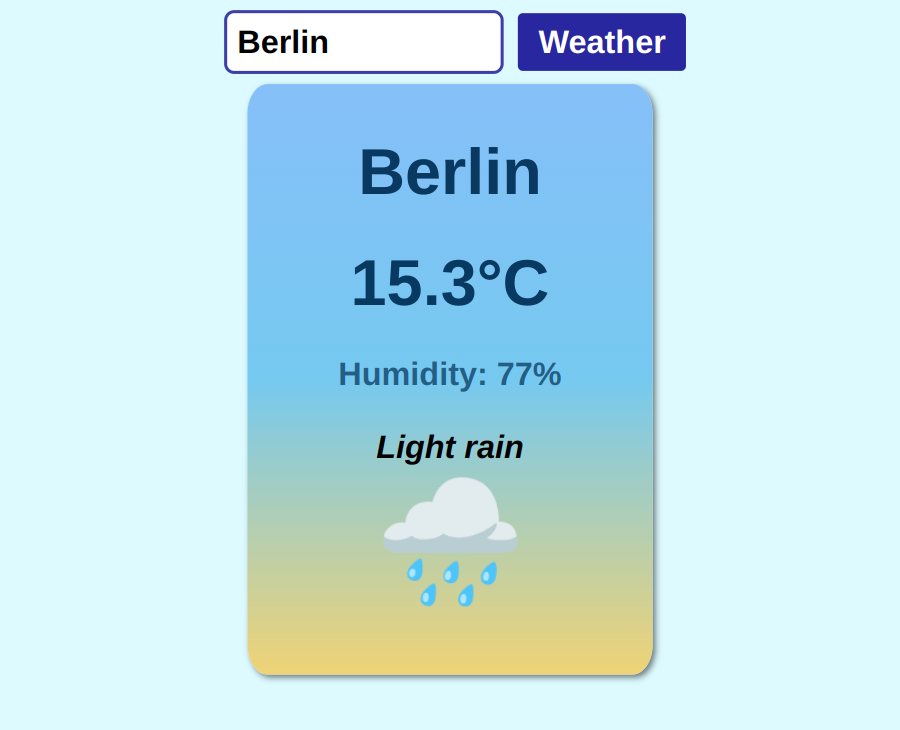

# Weather App

This Weather App is a simple web application that allows users to check the current weather of any city by entering its name. The app displays the temperature, humidity, weather condition, and an emoji representing the weather. It uses the Weather API to fetch real-time weather data.

## Features

- Fetches current weather information for a specified city.
- Displays temperature (in °C), humidity, and weather description.
- Shows an emoji that represents the current weather conditions.
- Handles errors, such as invalid city names or API request failures.

## Demo



## How to Use

1. Enter the name of the city in the input field.
2. Click the "Weather" button to retrieve the weather information.
3. Weather details, including temperature, humidity, and an appropriate weather emoji, will be displayed.

## Getting Started

To run this project locally, follow these steps:

### Prerequisites

- You need an API key from [Weather API](https://www.weatherapi.com/) to make API requests. Replace the placeholder API key in the `main.js` file with your own.

### Installation

1. Clone the repository:

   ```bash
   git clone https://github.com/Onid89/weather-app.git
   ```

2. Navigate to the project folder:

```bash

cd weather-app
```

## Usage

1. Open index.html in your web browser.
2. Replace the placeholder API key (---------------) in the main.js file with your own API key from Weather API.
3. Enter a city name in the input field and press the "Weather" button.

- Example
- Enter New York and see the weather conditions for that city displayed.

## CSS

- Basic styling is applied via style.css to make the app visually appealing.

## JavaScript

- The JavaScript in main.js handles:

- Submitting the form and fetching weather data.
- Displaying weather information on the page.
- Handling errors when invalid cities are entered or there are issues with the API call.

# Key Functions

- getWeatherData(city): Fetches weather data from the Weather API for the given city.
- displayWeatherInfo(data): Updates the UI with the retrieved weather data.
- getWeatherEmoji(weatherId): Returns an emoji based on the weather condition code.
- displayError(message): Displays an error message in case of invalid input or failed API requests.

# API

- "Remember" This app uses the Weather API to fetch the current weather data. You need to sign up for an API key.

# Technologies Used

- HTML
- CSS
- JavaScript
- Weather API
